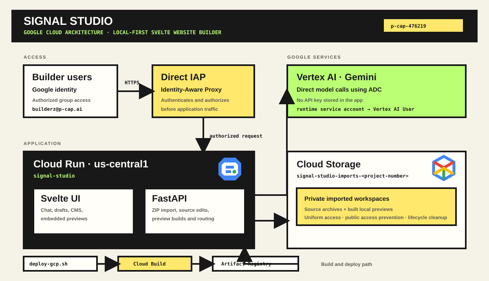

# Signal Studio — Svelte website builder & tech blogger

Signal Studio is a local-first Svelte website builder and lightweight tech-blog
authoring app. Import a Svelte or SvelteKit ZIP, use Gemini through Vertex AI in a chat
interface to propose changes, preview each change in an isolated local build,
and apply only the approved change to the imported copy.


## Demo video

<!-- Replace this placeholder with a short GIF that links to your full demo video. -->
[](https://github.com/user-attachments/assets/bd2eb9c3-b483-4e76-8f0a-9c87bf4bf625)

> Quick Video demo

## What it includes

- Svelte UI with navigation, Gemini chat, route detection, proposal review, and a resizable local preview
- ZIP import for local Svelte/SvelteKit project inspection and preview builds
- AI-assisted Svelte change proposals with disposable, isolated change previews
- A Posts CMS that creates local blog post drafts with title, slug, excerpt, body, and publication date/time
- Explicit **Preview change** then **Apply locally** workflow; no automatic publishing
- FastAPI backend and direct Vertex AI Gemini integration using Google ADC

## Configure Gemini through Vertex AI

Create `.env` from `.env.example` in the project root and use real values:

```dotenv
GOOGLE_CLOUD_PROJECT=YOUR_GCP_PROJECT_ID
GOOGLE_CLOUD_LOCATION=global
GOOGLE_GENAI_USE_VERTEXAI=True
GEMINI_MODEL=gemini-2.5-flash
```

Authenticate locally once:

```sh
gcloud auth application-default login
```

The `.env` file is ignored by Git. Stop and restart the API after changing it.

## Run locally

Install Python dependencies:

```sh
uv sync
```

If this project already has a partial virtual environment, rebuild it with the
same command before starting the API. This installs both FastAPI/Uvicorn and
the Google Gen AI SDK into `.venv`.

In terminal one, start the API:

```sh
uv run uvicorn app.fast_api_app:app --reload --port 8000
```

In terminal two, start the Svelte UI:

```sh
cd frontend
npm install
npm run dev
```

Open the displayed Vite URL, normally `http://localhost:5173`. Vite proxies
`/api/drafts` to the local FastAPI service. Gemini is invoked only by the
backend, using Application Default Credentials (ADC).

## Google Cloud deployment

The production container builds the Svelte UI and serves it from FastAPI, so
the UI, API, and imported-site previews share one Cloud Run origin. Direct
Cloud Run IAP then protects the entire builder with Google identity.

Terraform configuration and the secure deployment sequence are in
[`infra/gcp/README.md`](infra/gcp/README.md). It creates a dedicated runtime
service account with permission to call Vertex AI and a private Cloud Storage
bucket for temporary imported-project workspaces. The Gemini integration uses
Google ADC, so it requires no model API key or external secret. Store any future
non-Google integration secrets in Google Secret Manager, never in `.env`,
Terraform variables, or Git.

## Infrastructure



The production deployment is intentionally one IAP-protected Cloud Run service:
FastAPI serves the built Svelte UI, API, and isolated previews from the same
origin. Its runtime service account calls Gemini through Vertex AI and has
access only to the dedicated private workspace bucket; browsers never access
that bucket directly.

## Import a Svelte site

Use **Import a project** in the left sidebar and select a ZIP archive. Imports
are extracted into `.local-imports/`, which is ignored by Git. On Cloud Run,
the extracted source and static preview are also kept in the deployment's
private workspace bucket so a preview survives instance changes. The app
validates archive paths and size, detects the Svelte framework and routes, then
builds the extracted copy and shows it in the right-hand preview.

If the imported project has an articles, posts, or blog route, select **Posts**
to create a blog draft. The resulting local source change can be previewed at
the articles route before it is applied.

Try the supplied sample archive:

```text
../outputs/sample-svelte-site.zip
```

It contains a small SvelteKit site named `northstar-sample` with `/`, `/about`,
and `/contact` routes.

## Verify

These commands validate the code without sending a Gemini request:

```sh
uv run pytest tests/unit tests/integration
cd frontend && npm run build
```

## Boundaries

This prototype intentionally does not include GitHub, remote preview
deployments, commits, pull requests, or a publish button. Applying a change
modifies only the imported workspace after a successful preview. Cloud Run
workspaces are private and expire automatically; they are never published.
