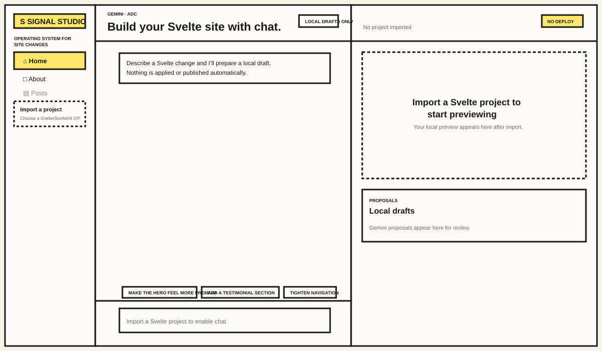
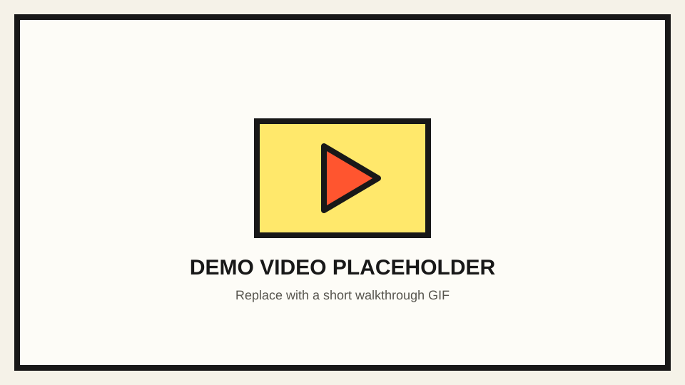

# Signal Studio — Svelte website builder & tech blogger

Signal Studio is a local-first Svelte website builder and lightweight tech-blog
authoring app. Import a Svelte or SvelteKit ZIP, use a Microsoft Foundry agent through a chat
interface to propose changes, preview each change in an isolated local build,
and apply only the approved change to the imported local copy.



## Demo video

<!-- Replace this placeholder with a short GIF that links to your full demo video. -->
[](YOUR_DEMO_VIDEO_URL)

> Add your full demo-video URL in place of `YOUR_DEMO_VIDEO_URL`. A 30–45 second walkthrough showing import, chat, preview, and apply works well here.

## What it includes

- Svelte UI with navigation, Foundry-agent chat, route detection, proposal review, and a resizable local preview
- ZIP import for local Svelte/SvelteKit project inspection and preview builds
- AI-assisted Svelte change proposals with disposable, isolated change previews
- A Posts CMS that creates local blog post drafts with title, slug, excerpt, body, and publication date/time
- Explicit **Preview change** then **Apply locally** workflow; no automatic publishing
- FastAPI backend and Microsoft Foundry integration using Azure CLI / `DefaultAzureCredential`

## Configure Microsoft Foundry

Create `.env` from `.env.example` in the project root and use real values:

```dotenv
FOUNDRY_PROJECT_ENDPOINT=https://your-resource.services.ai.azure.com/api/projects/your-project
FOUNDRY_AGENT_NAME=website-builder
FOUNDRY_AGENT_VERSION=2
```

Authenticate locally once:

```sh
az login
```

The `.env` file is ignored by Git. Stop and restart the API after changing it.

## Run locally

Install Python dependencies:

```sh
uv sync
```

If this project already has a partial virtual environment, rebuild it with the
same command before starting the API. This installs both FastAPI/Uvicorn and
the Microsoft Foundry SDK into `.venv`.

In terminal one, start the API:

```sh
uv run uvicorn app.fast_api_app:app --reload --port 8000
```

In terminal two, start the Svelte UI:

```sh
cd frontend
npm install
npm run dev
```

Open the displayed Vite URL, normally `http://localhost:5173`. Vite proxies
`/api/drafts` to the local FastAPI service. The Foundry agent is invoked only
by the backend, using your local Azure CLI identity via `DefaultAzureCredential`.

## Import a Svelte site

Use **Import a project** in the left sidebar and select a ZIP archive. Imports
are extracted only into `.local-imports/`, which is ignored by Git. The app
validates archive paths and size, detects the Svelte framework and routes, then
builds the extracted copy and shows it in the right-hand preview.

If the imported project has an articles, posts, or blog route, select **Posts**
to create a blog draft. The resulting local source change can be previewed at
the articles route before it is applied.

Try the supplied sample archive:

```text
../outputs/sample-svelte-site.zip
```

It contains a small SvelteKit site named `northstar-sample` with `/`, `/about`,
and `/contact` routes.

## Verify

These commands validate the code without sending a Foundry request:

```sh
uv run pytest tests/unit tests/integration
cd frontend && npm run build
```

## Boundaries

This prototype intentionally does not include GitHub, Cloud Storage, remote
preview deployments, commits, pull requests, or a publish button. Applying a
change modifies only the local imported copy after a successful preview.
